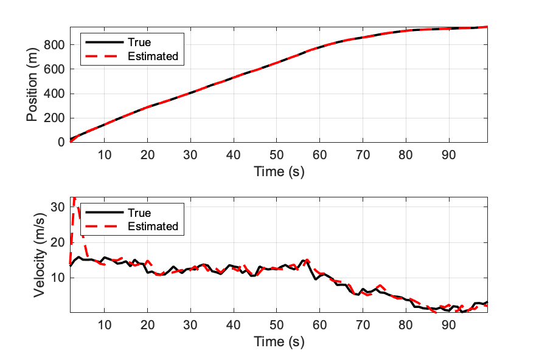
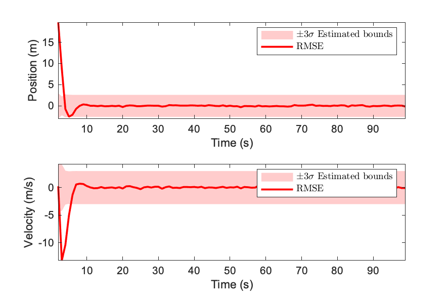
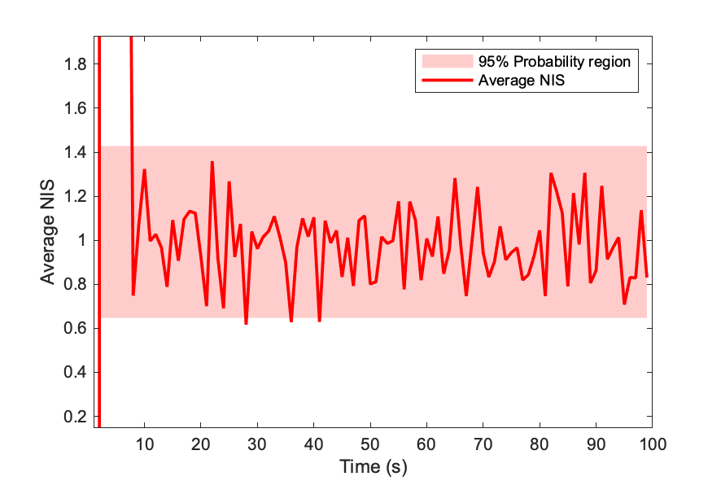
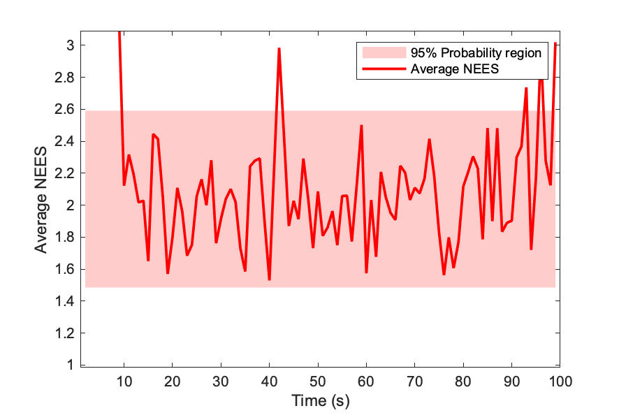

# linear-estimation
Useful Matlab scripts and Python notebooks for linear estiamtion. 

### Tracking the dynamic state (position, velocity and acceleration) using the Kalman filter
```
KFdemo.m
```
<p align="center">
 
 
</p>

<p align="center">
 
 
</p>

**References:**  
[1]. Bar-Shalom, Yaakov, X. Rong Li, and Thiagalingam Kirubarajan. Estimation with applications to tracking and navigation: theory algorithms and software. John Wiley & Sons, 2004
