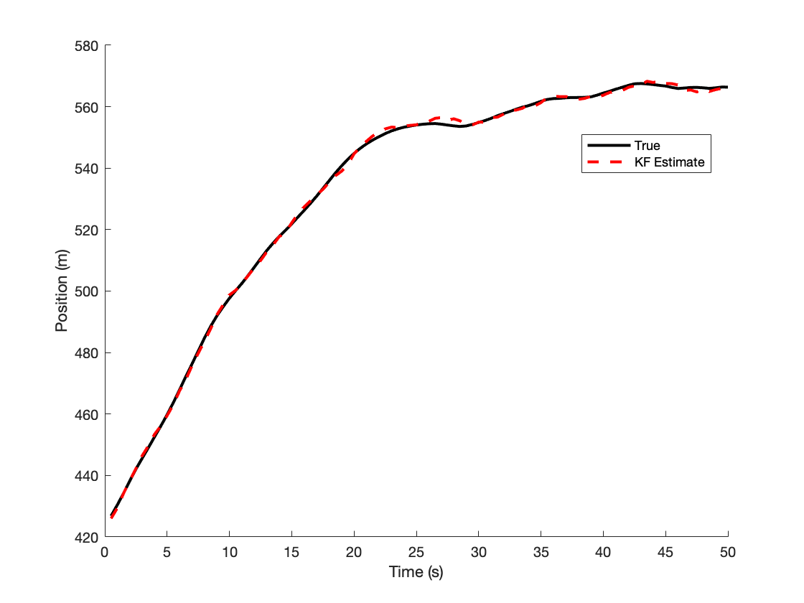
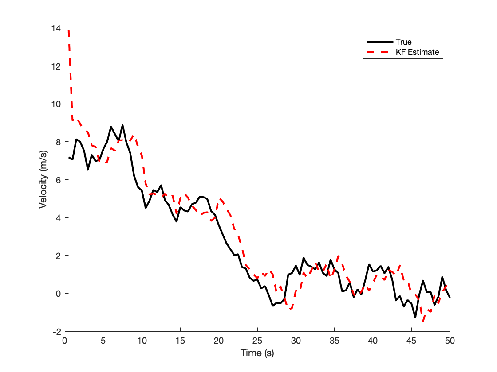

# Kalman Filter Target Tracking with Simulated Distance Measurements (Constant Velocity Model)

This repository provides a simple Matlab implementation of a Kalman Filter-based target tracking system using simulated distance measurements. The target's motion is assumed to follow a constant velocity model. In this example, the Kalman filter is tracking the state vector (position and velocity) of a dynamic target based on noisy measurements. The Kalman filter is initialized using a two-point initialization method [1].

Run the script:

```
KFtracking.m
```
To generate the following plots: 
<p align="center">
 
 
</p>

**References:**  
[1]. Bar-Shalom, Yaakov, X. Rong Li, and Thiagalingam Kirubarajan. Estimation with applications to tracking and navigation: theory algorithms and software. John Wiley & Sons, 2004
